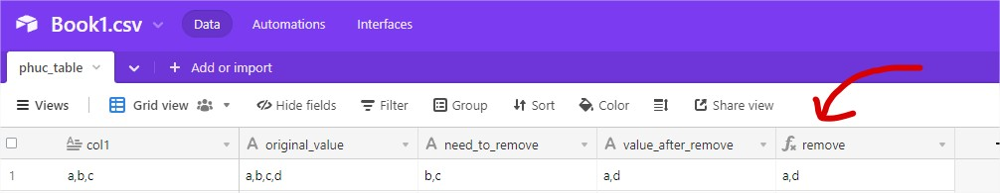

# **[Airtable] Substitute Multiple Strings**

## **JOB REQUIREMENTS**
<br />


### **Job Descriptions:**

    Hi everyone,

    Hope you’re going well.

    I’m struggling with a formula.

    Belows is the table:
    
<br />


| All Time Slots Rollup  | All Booked Time Slots Rollup  | Formula Column (column needed) |
| :------------ |:---------------| :-----|
| A, B, C, D    | A, C           | B, D  |
<br />


    I found the formula to make substitute one string.

    SUBSTITUTE(colomn1&"",colomn2&"","")

    Unfortunaly this formula doesn’t work when there is 
    more than 1 string in colomn2.

    What formula should I use ?

    Thank you in anticipation!


<br />

#
## **SOLUTIONS**
<br />

**Formula needed to extract data**




> For multiple lengths of string that must be removed. I also wrote a script to do it for you.

For example.

| origin | remove | removed |
|-----------|-----------|-----------|
| "a,b,c,d" | "b,c" | "a,d" |
| "z,y,x,n,b" | "y,x,z" | "n,b" |


<br />

<br />
Here is the function that was used in the script

<br />

```javascript
function removeA(arr) {
    var what, a = arguments, L = a.length, ax;
    while (L > 1 && arr.length) {
        what = a[--L];
        while ((ax= arr.indexOf(what)) !== -1) {
            arr.splice(ax, 1);
        }
    }
    return arr;
}
```

