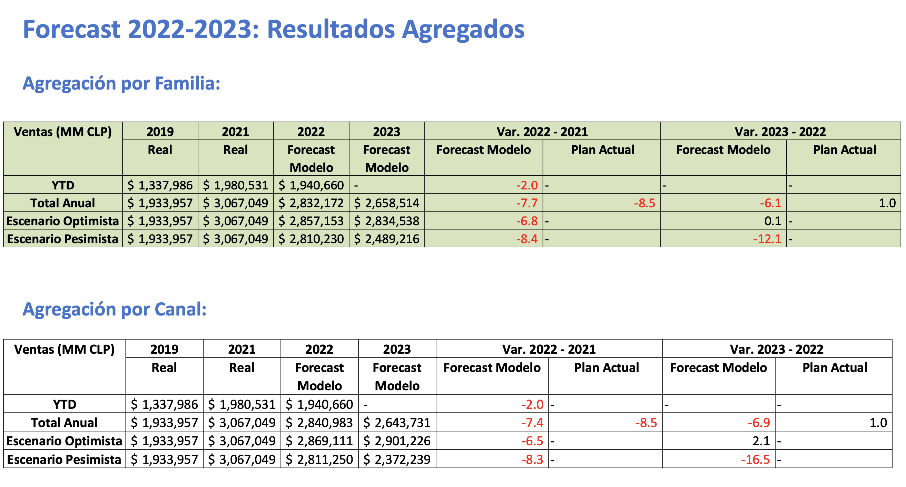
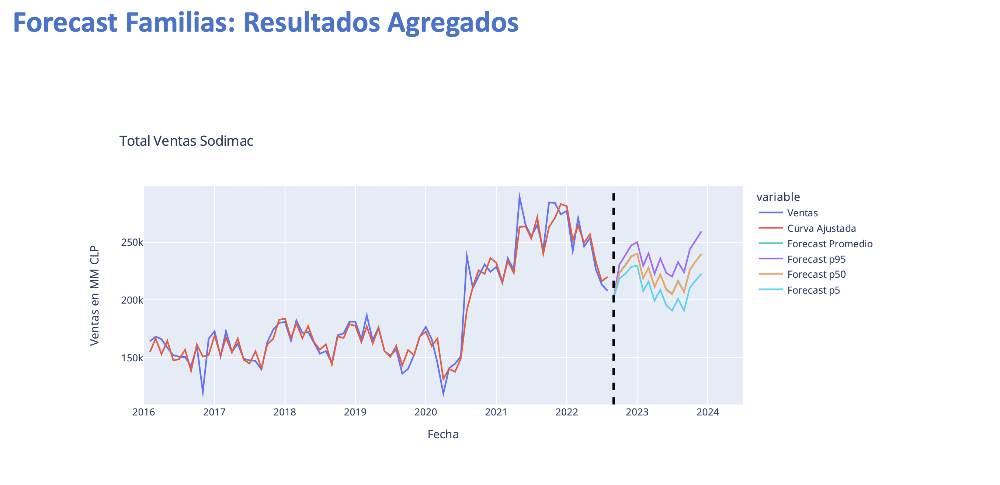
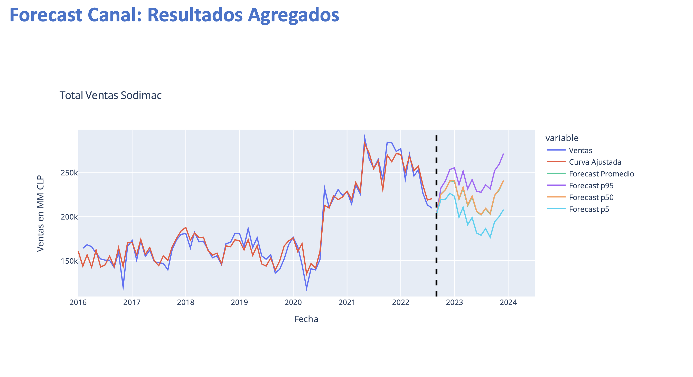
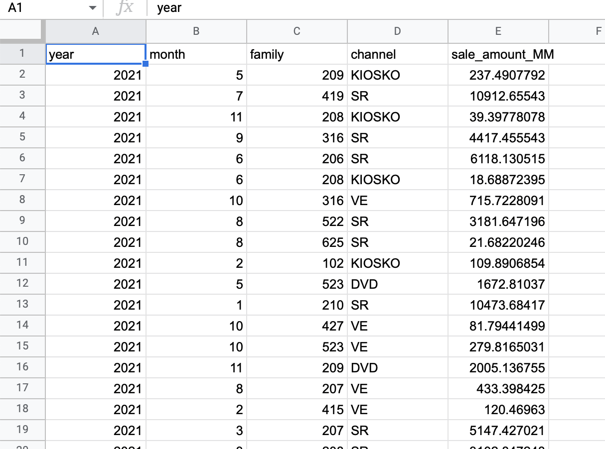

# **Documents**

Google Sheet Data: https://docs.google.com/spreadsheets/d/1weqG-lBj2e1HIl2VV2G3vXxUApJVnTggmf73OJHBORg/edit#gid=1097086947

BigQuery: https://console.cloud.google.com/bigquery?authuser=1&project=cloud-service-322312&ws=!1m4!1m3!3m2!1scloud-service-322312!2sproject_forecast_macro

Google Data Studio: https://datastudio.google.com/u/1/reporting/52ad81e3-e496-47e8-9656-24b6370dbb0e/page/qFp5C/edit

PDF Report Template: [Link](data/Resultados_Forecast_Ventas_22-23.pdf)

Excel file (contains formula): [Link](data/forecast-excel-2.xlsx)

# **TABLES AND CHARTS NEED TO VISUALIZE ON GDS**








# **DATA SOURCES**




# **SQL SCRIPT TO EXTRACT DATA**

**FAMILY LEVEL**

```sql
select * from project_forecast_macro.family_level
-- details in file
```

**CHANNEL LEVEL**

```sql
select * from project_forecast_macro.channel_level
-- details in file
```

# **DEFINITIONS**

Total Promedio = Forecast Promedio + Real

Total Optimista = Forecast p95 + Real

Total Pesimista = Forecast p5 + Real