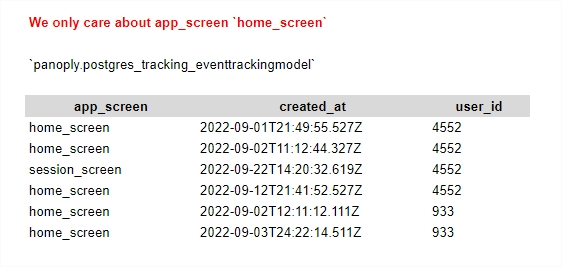
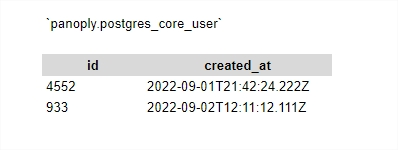
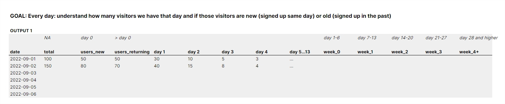
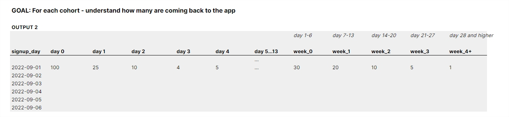
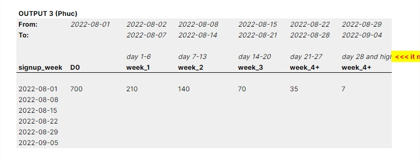
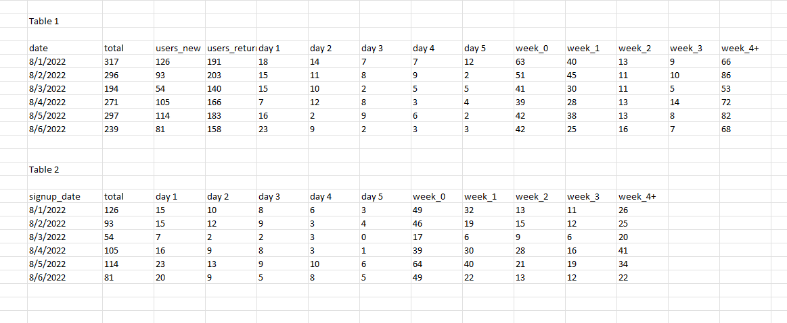

# **BIGQUERY - RETENTION REPORT**

## **JOB REQUIREMENTS**
 

##### **Here is challenge:** `<link>` : ***<https://www.awesomescreenshot.com/video/11261202?key=b4c595fbc30d465c5d43f0e73bab82da>***
 

##### **Here is the google sheet I was referencing:** `<link>` : ***<https://docs.google.com/spreadsheets/d/1GZIlfTqvdvbJjy-hdcXmh3gWLtFuS7Egtpmuhdl3WNI/edit?usp=sharing>***

 

### **Other Notes**
 

> **Table 1:** `<link>` : ***<https://github.com/nhphuc2210/previous-similar-projects/blob/main/bigquery--panoply/retention/table1.sql>***

> **Table 2:** `<link>` : ***<https://github.com/nhphuc2210/previous-similar-projects/blob/main/bigquery--panoply/retention/table2.sql>***

> **Table 3:** `<link>` : ***<https://github.com/nhphuc2210/previous-similar-projects/blob/main/bigquery--panoply/retention/table3.sql>***

 

## **Details**
#

### **Other Notes**

    That file only has app_screen = home_screen but the real data will have other app_screens as well so will need the filtering

    And w0 is a weird one because it's 6 days long and excluded d0
    
    Otherwise w0 would simply just be same as d0

 

**Raw data - Tracking Event**

 

**Raw data - User Registration**

 

**Expected Table 1**

**Expected Table 2**

**Expected Table 3**

 

**Expected Results**

