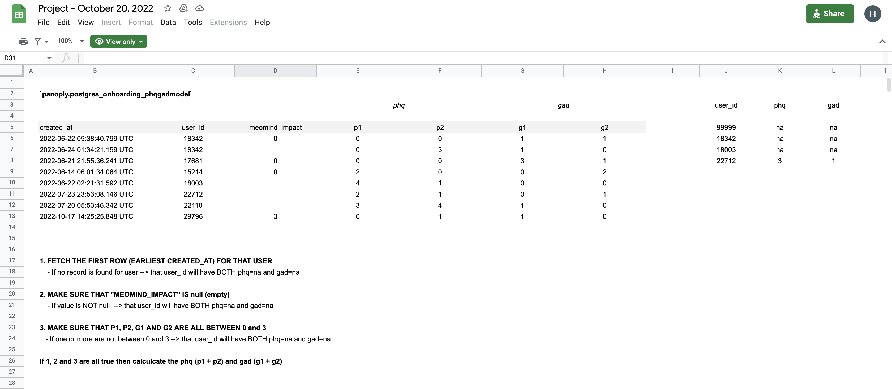
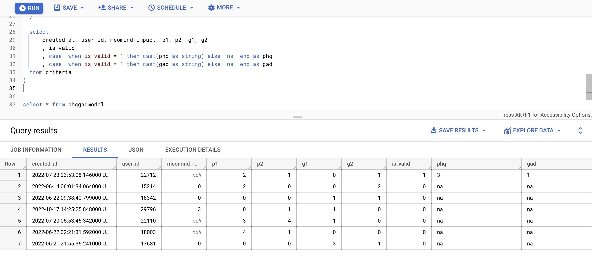

# **BIGQUERY - ACTIVITIES TRACKING**

## **JOB REQUIREMENTS**
<br />

##### **Here is challenge:** `<link>` : ***<https://www.awesomescreenshot.com/video/11866665?key=45287deb358ed3995e693c90cdd15448>***
<br />


##### **Here is the google sheet I was referencing:** `<link>` : ***<https://docs.google.com/spreadsheets/d/1Ey0JjbKjKmy5uOsvPhCuqFerJJNf2Sfkawe_JAaVaU4/edit?usp=sharing>***

<br />

**Requirement 1**



<br />

**Results 1**



<br />

**Here is your script**

FINAL RESULTS AS REQUIREMENTS

```sql


WITH
    get_user_device AS (
        WITH raw AS (
                -- replace null data
                SELECT id, COALESCE(signup_os, 'Unknown') AS signup_os
                FROM 
                  panoply.postgres_core_user
                --   panoply.postgres_core_user_v2
            )
            , add_rank AS (
                SELECT id, signup_os, RANK() OVER (PARTITION BY id ORDER BY signup_os) AS RANK
                FROM raw
            )
        SELECT id, signup_os
        FROM add_rank
        WHERE RANK = 1
    )

    , user_profile AS (
        WITH raw AS ( -- replace null data
                SELECT
                    user_id
                    , COALESCE(age, 'Unknown') AS age
                    , COALESCE(gender, 'Unknown') AS gender
                    , created_at
                FROM panoply.postgres_onboarding_onboardingusermodels
            )
            , add_rn AS ( -- add rn
                SELECT
                    user_id , age, gender,
                    RANK() OVER (PARTITION BY user_id ORDER BY created_at) AS rn
                FROM raw
            )
        SELECT user_id, age, gender
        FROM add_rn
        WHERE rn = 1
    )

    , phqgadmodel as (
      with raw_data as (
        -- Get first create at
        select created_at, user_id, meomind_impact, p1, p2, g1, g2, ROW_NUMBER() OVER (PARTITION BY user_id ORDER BY created_at) as rn
        from panoply.postgres_onboarding_phqgadmodel
      )

      , criteria as (
        -- 1. MAKE SURE THAT P1, P2, G1 AND G2 ARE ALL BETWEEN 0 and 3
        -- 2. MAKE SURE THAT "MEOMIND_IMPACT" IS null (empty)
        select *
          , case when     ((p1 between 0 and 3)
                    and  (p2 between 0 and 3)
                    and  (g1 between 0 and 3)
                    and  (g2 between 0 and 3))
                    and meomind_impact is null
                  then 1 else 0 end as is_valid

          , sum(p1+p2) as phq
          , sum(g1+g2) as gad
        from raw_data
        where rn = 1
        group by 1,2,3,4,5,6,7,8,9
      )

      select
          user_id, meomind_impact, p1, p2, g1, g2
          , is_valid
          , case  when is_valid = 1 then cast(phq as string) else 'na' end as phq
          , case  when is_valid = 1 then cast(gad as string) else 'na' end as gad
      from criteria

    )

    , register_table AS (
        SELECT
            a.id
            , created_at
            , DATE(created_at) AS sign_up_date
            , DATE(DATE_TRUNC(created_at, week(MONDAY))) AS week_start
            , COALESCE(a.signup_os, 'Unknown') signup_os
            , COALESCE(age, 'Unknown') age
            , COALESCE(gender, 'Unknown') gender
            , phq
            , gad
        FROM
            `panoply.postgres_core_user` a
            -- panoply.postgres_core_user_v2 a
        LEFT JOIN get_user_device b ON a.id = b.id
        LEFT JOIN user_profile c ON a.id = c.user_id
        LEFT JOIN phqgadmodel d ON a.id = d.user_id
        WHERE TRUE
    )

    , tracking_table AS (
        SELECT user_id, app_screen, created_at, DATE(created_at) AS grass_date
        FROM
            panoply.postgres_tracking_eventtrackingmodel
        WHERE TRUE
            AND user_id IS NOT NULL
            AND app_screen = 'home_screen'
    )


, my_data as (
SELECT
    a.week_start
    , sign_up_date
    , FORMAT_DATE("%m", sign_up_date) AS MONTH
    , gender
    , age
    , signup_os
    , phq
    , gad

    , COUNT(DISTINCT CASE WHEN a.sign_up_date = grass_date THEN id END) AS total
    , COUNT(DISTINCT CASE WHEN grass_date = date_add(sign_up_date, INTERVAL + 1 DAY) THEN id END) AS day1
    , COUNT(DISTINCT CASE WHEN grass_date = date_add(sign_up_date, INTERVAL + 2 DAY) THEN id END) AS day2
    , COUNT(DISTINCT CASE WHEN grass_date = date_add(sign_up_date, INTERVAL + 3 DAY) THEN id END) AS day3
    , COUNT(DISTINCT CASE WHEN grass_date = date_add(sign_up_date, INTERVAL + 4 DAY) THEN id END) AS day4
    , COUNT(DISTINCT CASE WHEN grass_date = date_add(sign_up_date, INTERVAL + 5 DAY) THEN id END) AS day5
    , COUNT(DISTINCT CASE WHEN grass_date = date_add(sign_up_date, INTERVAL + 6 DAY) THEN id END) AS day6
    , COUNT(DISTINCT CASE WHEN grass_date = date_add(sign_up_date, INTERVAL + 7 DAY) THEN id END) AS day7
    , COUNT(DISTINCT CASE WHEN grass_date = date_add(sign_up_date, INTERVAL + 8 DAY) THEN id END) AS day8
    , COUNT(DISTINCT CASE WHEN grass_date = date_add(sign_up_date, INTERVAL + 9 DAY) THEN id END) AS day9
    , COUNT(DISTINCT CASE WHEN grass_date = date_add(sign_up_date, INTERVAL + 10 DAY) THEN id END) AS day10
    , COUNT(DISTINCT CASE WHEN grass_date = date_add(sign_up_date, INTERVAL + 11 DAY) THEN id END) AS day11
    , COUNT(DISTINCT CASE WHEN grass_date = date_add(sign_up_date, INTERVAL + 12 DAY) THEN id END) AS day12
    , COUNT(DISTINCT CASE WHEN grass_date = date_add(sign_up_date, INTERVAL + 13 DAY) THEN id END) AS day13

    , COUNT(DISTINCT CASE WHEN grass_date BETWEEN date_add(sign_up_date, INTERVAL + 1 DAY) AND date_add(sign_up_date, INTERVAL + 6 DAY) THEN id END) AS w0
    , COUNT(DISTINCT CASE WHEN grass_date BETWEEN date_add(sign_up_date, INTERVAL + 7 DAY) AND date_add(sign_up_date, INTERVAL + 13 DAY) THEN id END) AS w1
    , COUNT(DISTINCT CASE WHEN grass_date BETWEEN date_add(sign_up_date, INTERVAL + 14 DAY) AND date_add(sign_up_date, INTERVAL + 20 DAY) THEN id END) AS w2
    , COUNT(DISTINCT CASE WHEN grass_date BETWEEN date_add(sign_up_date, INTERVAL + 21 DAY) AND date_add(sign_up_date, INTERVAL + 27 DAY) THEN id END) AS w3
    , COUNT(DISTINCT CASE WHEN grass_date > date_add(sign_up_date, INTERVAL + 27 DAY) THEN id END) AS w4_

FROM register_table a
LEFT JOIN tracking_table b ON id = b.user_id
WHERE TRUE
    AND b.user_id IS NOT NULL -- filter users that returned to home screen
    AND sign_up_date >= DATE '2022-04-04'
GROUP BY 1,2,3,4,5,6,7,8
)

select
      week_start
      , sign_up_date
      , MONTH
      , gender
      , age
      , signup_os

      , phq
      , gad

      , total, day1, day2, day3, day4, day5, day6, day7, day8, day9, day10, day11, day12, day13

      , w0, w1, w2, w3, w4_

from my_data


```
