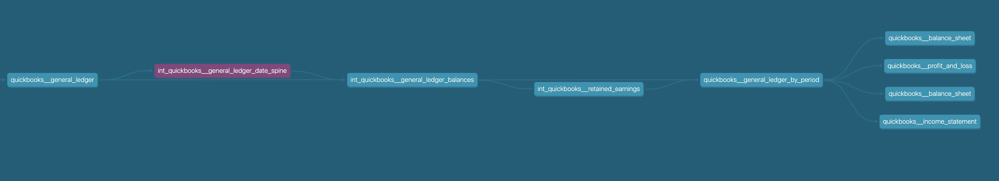

# **DBT SWICH MODEL**

<!-- nguyenthedanh1234@gmail.com
ngocdung

Github: 
nguyenthedanh1234@gmail.com
u4WMsQ6sxZuQBMY

dbt
https://cloud.getdbt.com/next/
nguyenthedanh1234@gmail.com
2y8U!fVaHpQeT6k -->

# **Switch existing models to a fiscal year date spine**

**Requirements:**

Switch existing models to a fiscal year date spine. The data spine get_fiscal_periods is available as dbt Jinja/macros in open sourced package: https://hub.getdbt.com/calogica/dbt_date/latest/

Switching to the new date spine might require making small changes to 7 upstream models for compatibility (see the graph attached).

Links to the models involved:
https://github.com/fivetran/dbt_quickbooks/blob/v0.5.3/models/intermediate/int_quickbooks__general_ledger_date_spine.sql

https://github.com/fivetran/dbt_quickbooks/blob/v0.5.3/models/intermediate/int_quickbooks__general_ledger_balances.sql

 

 

 

 

# **Migration S Dashboard - DBT**

Lastly, at this first stage as we need to clean up and cast the raw data please use the following package to see best practices on how it’s done in dbt: https://github.com/fivetran/dbt_quickbooks_source

1. Set up a staging model to clean up and merge raw payment data from 3 source tables: (1)fivetran daily sync table, (2) historical data from toast, (3) historical data from square. Expect source tables to have different schemas. 

2. Create dbt models for all business logic (views, queries etc) that are currently in BigQuery and Data Studio. Data Studio should not run any complex/time-consuming queries. 

3. Create a basic dbt test to check the validity of fivetran daily sync table data.

4. Set up a daily trigger in dbt to pull the latest daily data into the production BigQuery dataset. 

5. Switch Data Studio to use production BigQuery dataset managed by dbt.